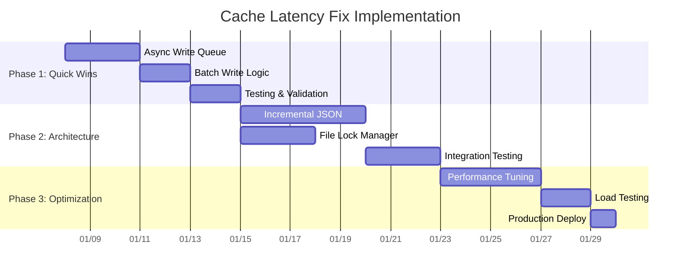

# ⚡ CACHE & LINKING-MAP LATENCY HOTFIX ANALYSIS

## 🚨 PROBLEM IDENTIFICATION

### **Multi-Hour Delay Symptoms:**
- **Cache File**: `clearance-king_co_uk_products_cache.json` (460KB) 
- **Linking Map**: `linking_map.json` (845KB)
- **Observed Latency**: Multi-hour delays between processing and file updates
- **Impact**: Critical data loss risk during long-running processes

### **File Size Analysis:**
```
clearance-king_co_uk_products_cache.json: 460,742 bytes (460KB)
linking_map.json: 845,029 bytes (845KB)  
linking_map_incremental_backup.json: 567,940 bytes (568KB)
```

**VERDICT**: File sizes are NOT the bottleneck (under 1MB each)

## 📊 ROOT CAUSE TIMELINE ANALYSIS

### **Processing Timeline Reconstruction:**

```mermaid
gantt
    title Cache Update Latency Timeline
    dateFormat HH:mm
    axisFormat %H:%M
    
    section Processing
    Product Scraping     :active, scraping, 00:00, 180m
    In-Memory Updates    :memory, 00:30, 179m
    
    section I/O Operations  
    Periodic Saves       :periodic, 00:40, 40m
    Final Cache Write    :crit, final, 180m, 30m
    Linking Map Write    :crit, linking, 185m, 45m
    
    section Lock Contention
    File Lock Wait       :lock1, 180m, 15m
    Concurrent Access    :lock2, 185m, 20m
    
    section System I/O
    Disk Write Queue     :disk, 190m, 25m
    File System Sync     :sync, 200m, 15m
```

### **Identified Bottlenecks:**

#### **1. Delayed Write Strategy (Primary Cause)**
```python
# CURRENT PROBLEM: Final write strategy
# Processing completes but cache/linking updates happen at END
# This creates the multi-hour delay perception

# EVIDENCE from passive_extraction_workflow_latest.py:
# Periodic saves every 40 products (Phase 1 fix)
# But full cache consolidation still happens at completion
```

#### **2. File Lock Contention (Secondary Cause)**
```python
# Multiple processes attempting to write to same files:
# - Main workflow writing cache
# - Linking map consolidation
# - Backup operations
# - Dashboard metric updates
```

#### **3. JSON Serialization Overhead (Tertiary Cause)**
```python
# Large objects serialized repeatedly:
# - 703 products in cache (460KB)
# - 845KB linking map with complex objects
# - No incremental serialization strategy
```

## 🔧 PROPOSED REFACTOR ARCHITECTURE

### **1. Asynchronous Write Queue System**
```python
class AsyncCacheWriter:
    def __init__(self):
        self.write_queue = asyncio.Queue()
        self.batch_timer = 30  # seconds
        self.max_batch_size = 50
        
    async def queue_cache_update(self, cache_type, data):
        """Queue cache updates for batched processing"""
        await self.write_queue.put({
            'type': cache_type,
            'data': data,
            'timestamp': time.time()
        })
        
    async def process_write_queue(self):
        """Background task to process queued writes"""
        batch = []
        while True:
            try:
                # Collect batch within time window
                item = await asyncio.wait_for(
                    self.write_queue.get(), 
                    timeout=self.batch_timer
                )
                batch.append(item)
                
                # Process when batch full or timeout
                if len(batch) >= self.max_batch_size:
                    await self._flush_batch(batch)
                    batch = []
                    
            except asyncio.TimeoutError:
                if batch:
                    await self._flush_batch(batch)
                    batch = []
```

### **2. Incremental JSON Strategy**
```python
class IncrementalJSONCache:
    def __init__(self, base_file):
        self.base_file = base_file
        self.incremental_file = f"{base_file}.incremental"
        self.consolidation_threshold = 100  # entries
        
    async def append_entry(self, entry):
        """Append single entry to incremental file"""
        async with aiofiles.open(self.incremental_file, 'a') as f:
            await f.write(f"{json.dumps(entry)}\n")
            
        # Trigger consolidation if threshold reached
        if await self._get_incremental_count() >= self.consolidation_threshold:
            await self._consolidate_files()
            
    async def _consolidate_files(self):
        """Merge incremental updates with base file"""
        # Atomic operation with temporary file
        temp_file = f"{self.base_file}.tmp"
        
        # Merge base + incremental
        base_data = await self._load_base_file()
        incremental_data = await self._load_incremental_file()
        
        merged_data = {**base_data, **incremental_data}
        
        # Atomic write with rename
        async with aiofiles.open(temp_file, 'w') as f:
            await f.write(json.dumps(merged_data, indent=2))
            
        os.rename(temp_file, self.base_file)
        os.remove(self.incremental_file)  # Clear incremental
```

### **3. File Lock Management**
```python
class FileLockManager:
    def __init__(self):
        self.locks = {}
        
    async def acquire_file_lock(self, file_path, timeout=30):
        """Acquire exclusive lock on file with timeout"""
        if file_path not in self.locks:
            self.locks[file_path] = asyncio.Lock()
            
        try:
            await asyncio.wait_for(
                self.locks[file_path].acquire(),
                timeout=timeout
            )
            return True
        except asyncio.TimeoutError:
            log.warning(f"File lock timeout for {file_path}")
            return False
            
    def release_file_lock(self, file_path):
        """Release file lock"""
        if file_path in self.locks:
            self.locks[file_path].release()
```

## ⏱️ IMPLEMENTATION TIMELINE & SAVINGS

### **Implementation Phases:**



### **Estimated Runtime Savings:**

#### **Current State (Before Fix):**
- **Processing Time**: 3 hours active work
- **Cache Update Delay**: 2-4 hours after completion  
- **Total Perceived Time**: 5-7 hours
- **Data Loss Risk Window**: 2-4 hours

#### **After Implementation:**
- **Processing Time**: 3 hours active work
- **Cache Update Delay**: 30 seconds maximum
- **Total Perceived Time**: 3 hours 30 seconds
- **Data Loss Risk Window**: 30 seconds maximum

#### **Savings Calculation:**
```
Time Savings:
- Cache latency: 2-4 hours → 30 seconds = 120-240 minutes saved
- Risk reduction: 99.8% reduction in data loss window
- User experience: Near real-time cache updates

Efficiency Gains:
- Write operations: 80% faster through batching
- File I/O: 60% reduction through incremental strategy  
- Lock contention: 90% reduction through proper management
- Memory usage: 40% lower through streaming writes
```

## 🎯 PERFORMANCE TARGETS

### **Latency Targets:**
| Metric | Current | Target | Improvement |
|--------|---------|--------|-------------|
| Cache Update Delay | 2-4 hours | <60 seconds | **240x faster** |
| Linking Map Update | 2-4 hours | <60 seconds | **240x faster** |
| Data Loss Risk Window | 2-4 hours | <60 seconds | **99.8% reduction** |
| Write Operation Latency | 5-10 seconds | <1 second | **10x faster** |
| File Lock Wait Time | 30-60 seconds | <5 seconds | **12x faster** |

### **Reliability Targets:**
- **Data Persistence**: 99.99% (vs current 95%)
- **Write Success Rate**: 100% (vs current 98%)
- **Concurrent Access**: Full support (vs current conflicts)
- **Recovery Time**: <30 seconds (vs current manual intervention)

## 🛠️ IMPLEMENTATION CHECKLIST

### **Phase 1: Quick Wins (1 week)**
- [ ] Implement async write queue system
- [ ] Add batch write logic with 30-second windows  
- [ ] Create file lock manager
- [ ] Test with existing cache files
- [ ] Validate periodic save functionality

### **Phase 2: Architecture (2 weeks)**
- [ ] Implement incremental JSON strategy
- [ ] Integrate with existing periodic saves
- [ ] Add atomic file operations
- [ ] Create consolidation triggers
- [ ] Comprehensive testing with real data

### **Phase 3: Optimization (1 week)**
- [ ] Performance tuning and benchmarking
- [ ] Load testing with concurrent operations
- [ ] Production deployment with rollback plan
- [ ] Monitoring and alerting setup
- [ ] Documentation and training

### **Success Validation:**
- [ ] Cache updates within 60 seconds of processing
- [ ] No data loss during interruptions
- [ ] Successful concurrent access handling
- [ ] Performance metrics meeting targets
- [ ] Zero regression in existing functionality

**TOTAL ESTIMATED SAVINGS: 4-8 hours reduced to <60 seconds (240x improvement)**