# 🔄 DUPLICATE CATEGORY & SUBCATEGORY SCRAPING STRATEGY

## 📋 CURRENT WORKFLOW SUMMARY

### **Homepage-URL → AI → Scrape Loop Methodology**

```mermaid
flowchart TD
    A[Homepage Discovery] --> B[Extract Category URLs]
    B --> C{Phase 3: Parent-Child Analysis}
    C --> D[Validate Parent Product Count]
    D --> E{Parent ≥2 Products?}
    E -->|YES| F[Process Parent Only]
    E -->|NO| G[Process Parent + Children]
    F --> H[Apply AI Category Selection]
    G --> H
    H --> I[Execute Scraping Workflow]
    I --> J[Amazon Matching & Analysis]
```



## 🎯 PRODUCT URL VERIFICATION PROCESS

### **How the System Verifies ≥2 Product URLs (Not Subcategories)**

#### **1. Category Validation Logic:**
```python
# From passive_extraction_workflow_latest.py:1691-1707
async def _validate_category_productivity(url):
    validation_result = await self._validate_category_productivity(url)
    
    if validation_result["is_productive"]:
        # Counts actual PRODUCT listings, not subcategory links
        product_count = validation_result['product_count']
        return product_count >= 2
```

#### **2. Product vs Subcategory Distinction:**
- **Product URLs**: Direct links to individual items with prices/EANs
- **Subcategory URLs**: Navigation links to deeper category levels
- **Validation**: Uses CSS selectors to identify actual product listings
- **Count Source**: Only counts elements with product-specific attributes

#### **3. Productivity Threshold:**
```python
# Core deduplication logic
if parent_product_count >= 2:
    # Parent category has sufficient actual products
    skip_subcategory_scraping = True
    use_pagination_only = True
else:
    # Parent category lacks products, explore subcategories  
    scrape_subcategories = True
```

## 🔍 SUBCATEGORY RECURSION METHODOLOGY

### **When Subcategories Are Processed:**

#### **Scenario A: Productive Parent (≥2 Products)**
```
Parent: /health-beauty.html
├── Products Found: 15 items
├── Decision: SKIP subcategories
├── Action: Use pagination for more products
└── Subcategories Ignored: /health-beauty/cosmetics.html, /health-beauty/skincare.html
```

#### **Scenario B: Unproductive Parent (<2 Products)**  
```
Parent: /specialty-items.html
├── Products Found: 1 item
├── Decision: INCLUDE subcategories
├── Action: Process all child categories
└── Subcategories Processed: /specialty-items/novelty.html, /specialty-items/collectibles.html
```

### **Recursion Stopping Rules:**

#### **1. First Level Meeting Product Count:**
- **Rule**: Stop at the first category level that yields ≥2 products
- **Implementation**: Product count validation before deeper recursion
- **Benefit**: Prevents unnecessary deep drilling

#### **2. Maximum Depth Limit:**
```python
# From configurable_supplier_scraper.py:973-979
async def discover_subpages(self, category_url: str, max_depth: int = 1, current_depth: int = 0):
    if current_depth >= max_depth:
        log.info(f"Max depth {max_depth} reached for subpage discovery")
        return [category_url]
```

#### **3. Productivity Validation:**
- Each level validated independently
- Unproductive branches terminated early
- Resource allocation optimized

## 🚨 EDGE-CASE ANALYSIS & PROPOSED FIXES

### **Edge Case 1: Mixed Product & Subcategory Pages**

#### **Problem:**
Some category pages contain BOTH product listings AND subcategory links:
```
/electronics.html
├── Direct Products: 3 items (laptops, phones, tablets)
├── Subcategories: /electronics/computers.html, /electronics/accessories.html
└── Current Behavior: Process parent only (≥2 products found)
```

#### **Risk:**
Missing deeper product pools in subcategories despite parent productivity.

#### **Proposed Fix:**
```python
# ENHANCED LOGIC
async def _validate_mixed_category_productivity(self, url):
    """Enhanced validation for mixed product/subcategory pages"""
    page_analysis = await self._analyze_page_structure(url)
    
    direct_products = page_analysis['product_count']
    subcategory_links = page_analysis['subcategory_count']
    
    # Mixed page detection
    if direct_products >= 2 AND subcategory_links >= 3:
        # High-potential mixed page - sample subcategories
        sample_subcategories = page_analysis['subcategories'][:2]
        subcategory_potential = await self._estimate_subcategory_yield(sample_subcategories)
        
        if subcategory_potential > direct_products * 2:
            return "process_both"  # Process parent + promising subcategories
        else:
            return "process_parent_only"
    
    return "standard_logic"  # Apply existing ≥2 rule
```

### **Edge Case 2: Deep Nested Category Structures**

#### **Problem:**
Multi-level category hierarchies with varying product distributions:
```
/home-garden.html (1 product)
└── /home-garden/furniture.html (15 products)
    └── /home-garden/furniture/chairs.html (45 products)
        └── /home-garden/furniture/chairs/office.html (12 products)
```

#### **Risk:**
Current depth limit may miss highly productive deep categories.

#### **Proposed Fix:**
```python
# ADAPTIVE DEPTH EXPLORATION
async def _adaptive_depth_exploration(self, category_url, max_depth=3):
    """Dynamically adjust exploration depth based on productivity signals"""
    depth = 0
    current_url = category_url
    productivity_trend = []
    
    while depth < max_depth:
        productivity = await self._validate_category_productivity(current_url)
        productivity_trend.append(productivity['product_count'])
        
        # Stop if productivity is decreasing for 2 consecutive levels
        if len(productivity_trend) >= 3:
            if productivity_trend[-1] < productivity_trend[-2] < productivity_trend[-3]:
                break
                
        # Continue if trend is increasing
        if productivity['product_count'] > 0:
            subcategories = await self._discover_subcategories(current_url)
            if subcategories:
                current_url = subcategories[0]  # Follow most promising path
                depth += 1
            else:
                break
        else:
            break
    
    return productivity_trend
```

### **Edge Case 3: Pagination vs Subcategory Confusion**

#### **Problem:**
Some sites use pagination links that look like subcategories:
```
/toys.html
├── Products: Page 1 (12 items)
├── Pagination: /toys.html?page=2, /toys.html?page=3
├── False Subcategories: /toys/action-figures.html, /toys/dolls.html
└── Current Risk: Pagination links treated as subcategories
```

#### **Proposed Fix:**
```python
# PAGINATION PATTERN DETECTION
def _distinguish_pagination_from_subcategories(self, links):
    """Separate pagination links from true subcategory links"""
    pagination_patterns = [
        r'\?page=\d+',
        r'\?p=\d+', 
        r'/page/\d+',
        r'&start=\d+',
        r'&offset=\d+'
    ]
    
    pagination_links = []
    subcategory_links = []
    
    for link in links:
        is_pagination = any(re.search(pattern, link) for pattern in pagination_patterns)
        if is_pagination:
            pagination_links.append(link)
        else:
            subcategory_links.append(link)
    
    return {
        'pagination': pagination_links,
        'subcategories': subcategory_links,
        'total_pages_available': len(pagination_links)
    }
```

### **Edge Case 4: Dynamic Content Loading**

#### **Problem:**
JavaScript-loaded categories not detected by initial scraping:
```
/categories.html
├── Initially Visible: 5 categories
├── Load More Button: Reveals 15 additional categories
└── Current Miss: Dynamic categories not discovered
```

#### **Proposed Fix:**
```python
# DYNAMIC CONTENT DETECTION
async def _handle_dynamic_category_loading(self, page_url):
    """Detect and handle dynamically loaded categories"""
    # Look for common dynamic loading indicators
    dynamic_indicators = [
        'button:contains("Load More")',
        'a:contains("Show All Categories")', 
        '.load-more-categories',
        '[data-load-more]'
    ]
    
    additional_categories = []
    
    for indicator in dynamic_indicators:
        try:
            # Attempt to trigger dynamic loading
            await self._click_element_and_wait(indicator)
            new_categories = await self._extract_categories()
            additional_categories.extend(new_categories)
        except:
            continue  # Indicator not present or not functional
            
    return additional_categories
```

## 📊 IMPLEMENTATION ROADMAP

### **Priority 1: Mixed Page Enhancement**
- **Timeline**: Immediate (next development cycle)
- **Impact**: High (catches missed product pools)
- **Complexity**: Medium (requires page structure analysis)

### **Priority 2: Pagination Pattern Detection**  
- **Timeline**: Short-term (within 2 weeks)
- **Impact**: Medium (improves category classification accuracy)
- **Complexity**: Low (regex pattern matching)

### **Priority 3: Adaptive Depth Exploration**
- **Timeline**: Medium-term (1 month)
- **Impact**: High (optimizes deep category exploration)
- **Complexity**: High (requires trend analysis logic)

### **Priority 4: Dynamic Content Handling**
- **Timeline**: Long-term (2-3 months)
- **Impact**: Medium (catches JS-loaded categories)
- **Complexity**: Very High (requires browser automation enhancement)

## ✅ SUCCESS METRICS

### **Current Performance:**
- **URL Reduction**: 30-40% fewer redundant URLs processed
- **Processing Efficiency**: 50% improvement in productive parent scenarios
- **Coverage Maintenance**: 100% product discovery preservation

### **Enhanced Performance Targets:**
- **Mixed Page Detection**: 95% accuracy in identifying hybrid pages
- **Deep Category Discovery**: 80% improvement in finding productive deep categories  
- **Pagination Accuracy**: 100% separation of pagination from subcategories
- **Dynamic Content**: 70% capture rate of dynamically loaded categories

This strategy ensures **intelligent category exploration** while maintaining **comprehensive product coverage** and **processing efficiency**.